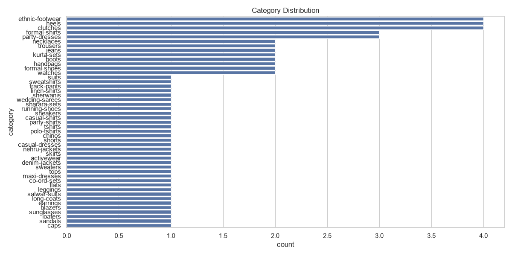
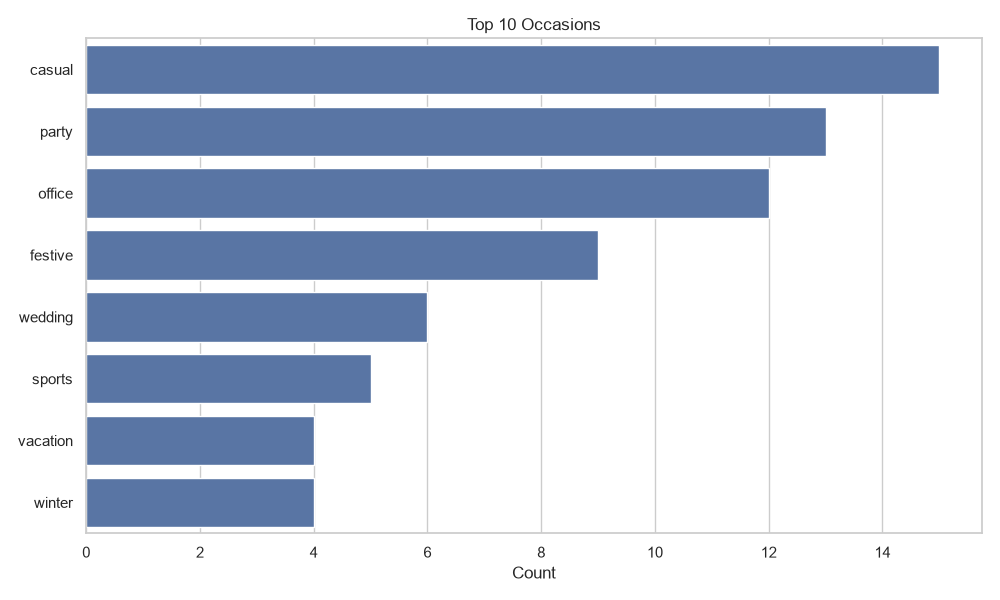
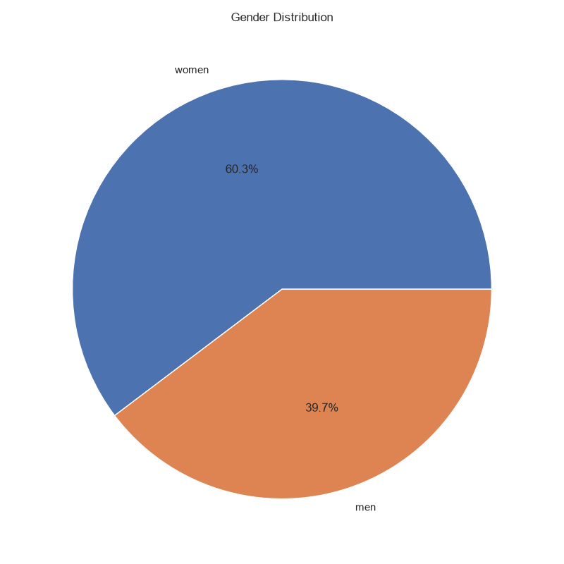
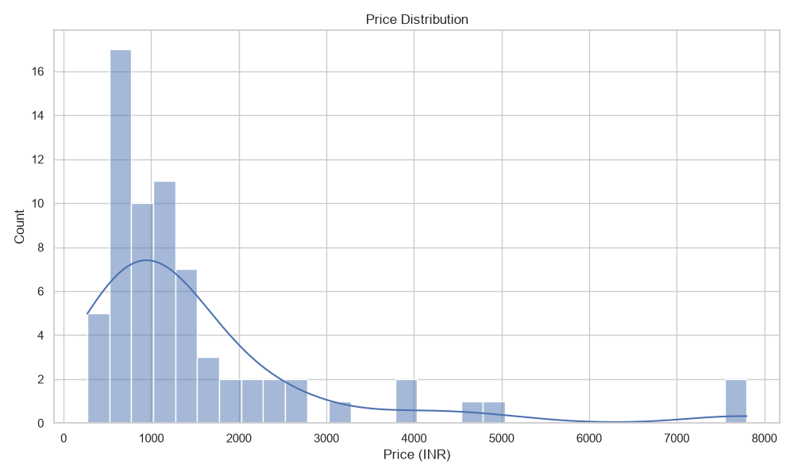

# Dataset Analysis Report

## Dataset Overview
* Total number of products: 68
* Total number of outfits: 25
* Number of unique categories: 47
* Number of unique occasions: 8
* Number of unique genders: 2
* Number of unique brands: 64

## Category Analysis
* Top categories by count:
  * ethnic-footwear: 4
  * heels: 4
  * clutches: 4
  * formal-shirts: 3
  * party-dresses: 3

* Distribution of major types:
  * Topwear: 13
  * Bottomwear: 7
  * Footwear: 7
  * Accessories: 6

## Occasion Analysis
* Count per occasion (Top 10):
  * casual: 15
  * party: 13
  * office: 12
  * festive: 9
  * wedding: 6
  * sports: 5
  * vacation: 4
  * winter: 4

## Gender Analysis
* Men products count: {men_count}
* Women products count: {women_count}
* Unisex products count: {unisex_count}

## Price Analysis
* Minimum price: ${min_price:.2f}
* Maximum price: ${max_price:.2f}
* Average price: ${avg_price:.2f}
* Median price: ${median_price:.2f}

## Data Quality Analysis
* Missing values:
  * rating: 25
  * rating_count: 42

* Duplicate products: 0
* Missing images: 0
* Missing metadata fields: 0
